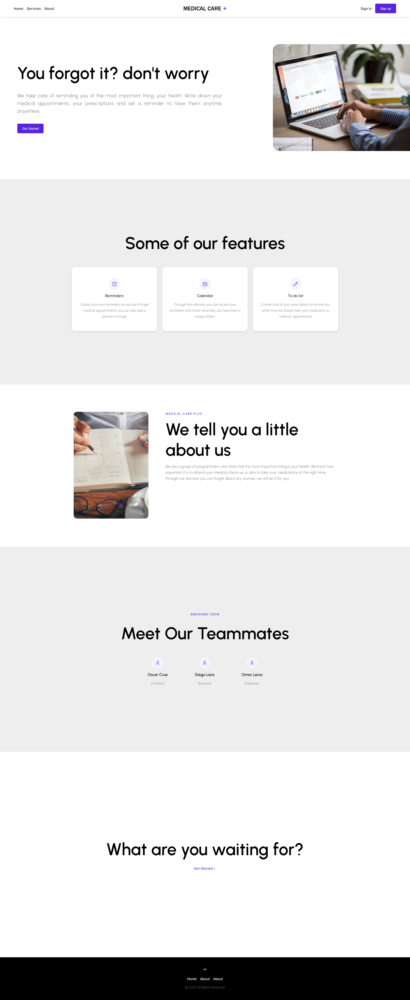
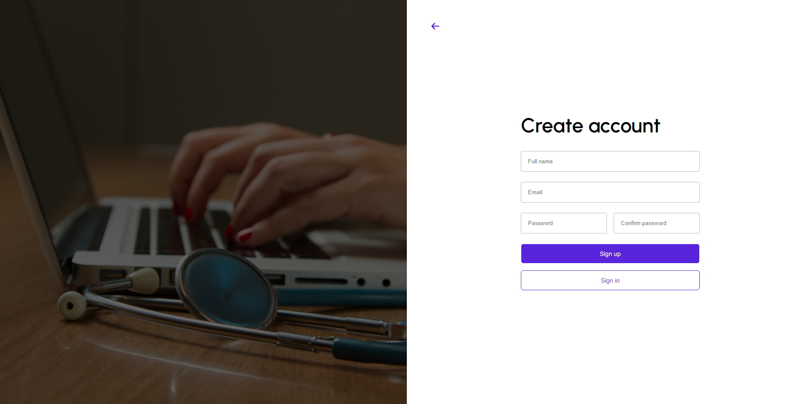
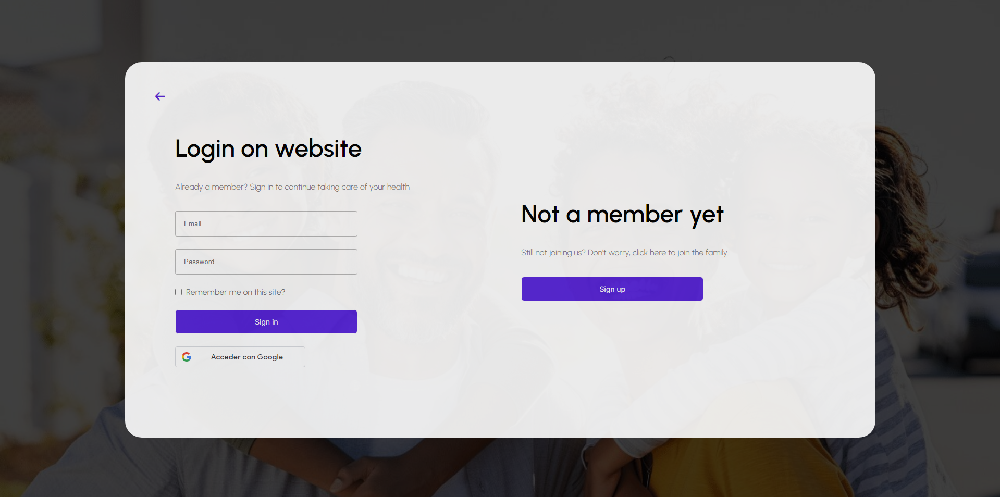
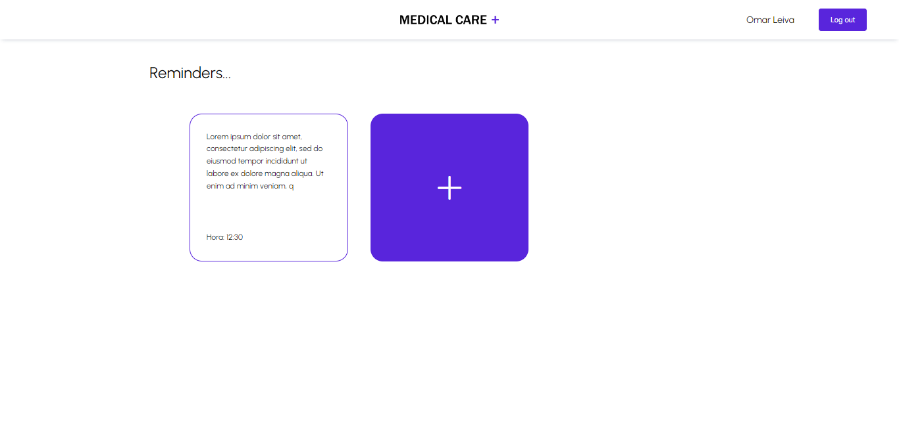
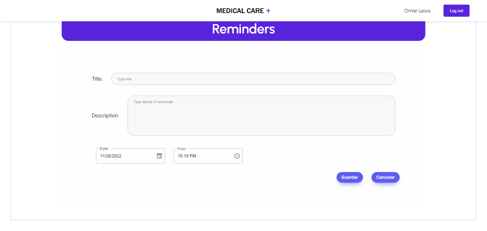

# Medical Care Plus +

- [Medical Care Plus +](#medical-care-plus-+)
  - [Acerca de la aplicación](#acerca-de-la-aplicación)
  - [Tecnologías utilizadas](#tecnologías-utilizadas)
    - [React](#react)
    - [Vite](#vite)
    - [Yarn](#yarn)
    - [Mongodb atlas](#mongodb-atlas)
    - [Mongoose](#mongoose)
    - [Nodemon](#nodemon)
    - [Google calendar](#google-calendar)
  - [Configuraciones necesarias para utilizar la aplicación](#configuraciones-necesarias-para-utilizar-la-aplicación)
    - [Cliente](#cliente)
    - [API](#api)
    - [Proyecto deployado](#proyecto-deployado)
  - [Manual de usuario](#manual-de-usuario)
    - [Pagina principal](#pagina-principal)
    - [Registro](#registro)
    - [Inicio de sesión](#inicio-de-sesión)
    - [Recordatorios](#recordatorios)
    - [Crear recordatorios](#crear-recordatorios)
    - [Cerrar sesión](#cerrar-sesión)

## Acerca de la aplicación

El proyecto de Medical Care plus es una aplicación web la cual permitirá que los usuarios puedan llevar un correcto control de su salud, abarcando diferentes áreas de interés para los usuarios como: la medicación que deben tomarse los usuarios ya sea por una enfermedad crónica o para lograr la completa recuperación de algún padecimiento, recordatorios ya sea para mantenerse hidratado y/o para llevar una buena alimentación, además de tener un calendario que por medio de la aplicación notifique las consultas, exámenes o revisiones que el usuario tiene programado próximamente, por otra parte un usuario podrá tener un encargado para verificar que cumpla con la necesidad médica.

## Tecnologías utilizadas


### React

React te ayuda a crear interfaces de usuario interactivas de forma sencilla. Diseña vistas simples para cada estado en tu aplicación, y React se encargará de actualizar y renderizar de manera eficiente los componentes correctos cuando los datos cambien.

### Vite

Vite es una herramienta de tooling para el Frontend. Lo puedes agrupar en la categoría donde se encuentran otros como Webpack, Parcel y Snowpack. Es muy útil para crear una estructura de proyecto que se pueda utilizar con React y de una forma muy rápida, ya que no necesitas tener que configurar nada.

### Yarn

Yarn es un gestor de paquetes para tu código. Te permite usar y compartir código con otros desarrolladores de cualquier parte del mundo.

### Mongodb atlas

MongoDB Atlas es una base de datos en la nube completamente administrada que maneja toda la complejidad de implementar, administrar y reparar sus implementaciones en el proveedor de servicios en la nube de su elección (AWS, Azure y GCP). MongoDB Atlas es la mejor manera de implementar, ejecutar y escalar MongoDB en la nube.

### Mongoose

Mongoose es una librería para Node. js que nos permite escribir consultas para una base de datos de MongooDB, con características como validaciones, construcción de queries, middlewares, conversión de tipos y algunas otras, que enriquecen la funcionalidad de la base de datos.

### Nodemon

Nodemon es una utilidad de interfaz de línea de comandos (CLI) desarrollada por @rem que envuelve su aplicación Node, vigila el sistema de archivos y reinicia automáticamente el proceso.

### Google calendar

Google Calendar es la herramienta de calendarios para empresas de Google Workspace. Con Google Workspace Calendar podrás compartir calendarios con otras personas de dentro o fuera de tu empresa, así como equipos, para estar al corriente de los próximos eventos o reuniones.

## Configuraciones necesarias para utilizar la aplicación

Para comenzar a configurar la aplicacion para utilizarla aplicacion de manera local lo primero que hay que hacer es:

- Clonar el repositorio con el siguiente comando

  - HTTPS 
  ```
  git clone https://github.com/Programacion-Web-02-2022/parcial-i-grupo-de-trabajo-16-medicalcare.git
  ```
  - SSH
   ```
  git clone git@github.com:Programacion-Web-02-2022/parcial-i-grupo-de-trabajo-16-medicalcare.git
  ```


### Cliente

Para configurar la parte del cliente se debe seguir los siguientes pasos.

1. Dentro del directorio raiz tenemos que entrar a la carpeta `Client`

```
cd Client/mcp-project/
```

2. Una vez dentro del directorio es necesario instalar toda la paquetería para que el proyecto funcione. 

```
yarn
```

3. Ya que la paquetería está instalada. Procede a levantar el proyecto de React creado por medio de Vite. Ejecutando:

```
yarn dev
```

4. En consola se mostrará en que puerto del localhost está corriendo el proyecto. Accede a él y deberías la pagina principal de la aplicacion.

### API

Para configurar la parte de la api se deben ejecutar los siguientes pasos.

1. Dentro del directorio raiz tenemos que entrar a la carpeta `Server`

```
cd Server/mcp-api
```
2. Ahora procederemos a ejecutar los siguientes comandos:

```
npm i -D nodemon
```

```
npm i mongoose
```

3. Por ultimo para levantar la API ejecutaremos:

```
npm run start:dev
```
Con todo eso a deberiamos de tener levantada la API

### Proyecto deployado

Para ver el proyecto ya deployado puedes hacer click en este enclace:

Vercel: https://medical-care-plus.vercel.app

Sitio web: https://diego.ticongle.com

## Manual de usuario

### Pagina principal

- Lo primero que nos aparecera sera la pagina principal donde podemos encontrar informacion sobre la aplicación, que ofrece la aplicación, información del equipo de trabajo, etc.



### Registro

- Para ingresar en el registro se le tiene que dar en la pagina principal al boton "Sign up", y le aparecera esta pantalla donde puede usted crear su cuenta, una vez creada lo redirigira al inicio de sesión.



### Inicio de sesión

- Se puede acceder a este desde la pagina principal dandole click al boton "Sign in" en la parte superior derecha de la pantalla, posterior mente le aparecera esta pantalla donde usted puede ingresar con la cuenta que creó, o con alguna cuenta que ya tenga de Google.



### Recordatorios

- Despues de iniciar sesión le aparecera esta pantalla donde se puede crear recordatorios al hacerle click a la carta azul.



### Crear recordatorios

- Despues de darle click a la carta azul se abrira un modal donde ya se puede meter informacion de como quiere que sea el recordatorio y al darle click en guardar automaticamente se sincroniza con Google Calendar y se agrega el recordatorio, si se da en el boton cancelar, simplemente se cierra el modal.



### Cerrar sesión

- Por ultimo, para cerrar sesión solamete se debe dar click en el boton azul en la esquina superior derecha que dice "Log out", una vez cerrada la sesión lo llevara a la pagina principal.


